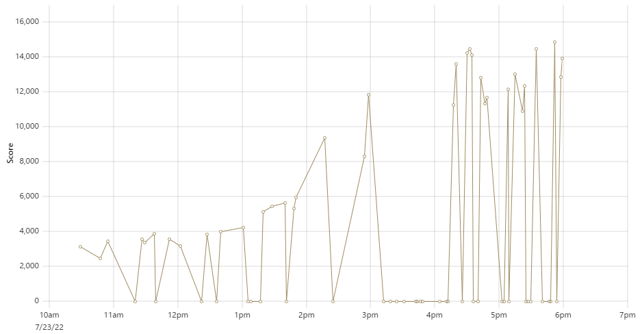

どうもこんにちは、夏休みの予定が順調にギチギチになってきております。  
logicaです。

かねてから[remote-bmi](https://github.com/logica0419/remote-bmi)というISUCON練習に便利なツールを作るほどにはISUCON好きな僕ですが、この度ISUCON12の予選に参戦して来ました。  
今回のチームメイトは[anko](https://twitter.com/Anko_9801)、[はっしゅ](https://twitter.com/harsh_dayo)です。  
こんな頼りないリーダーに付いてきてくれてBig感謝。

というわけで予選レポートです。

# 予選の結果について

最終スコア 13923点、失格を除いて全体58位 / 学生8位(自社調べ)でしたが、学生枠最下位ということでなんとか予選突破させていただきました！

本当に「辛くも」としか言えない結果...  
一般枠のボーダーが23000点付近の中、13000点台での突破はあまりにも差がありすぎて、一般枠で僕らを超えているチームに対して申し訳なさ過ぎて胃が痛いです。  
去年のISUCON直前にサークルの方の紹介でISUCONを知り、今回2回目の参加としては全体58位は十分すぎるかもしれませんが、正直もう少しは歯が立つと思っていました...

これ以上のスコアを取るためには僕らに何が必要だったのか、予選が終わってから、そして予選通過してしまったことを知ってからはさらに深く考え込んでいたので、予選の様子を振り返りながら綴らせていただきます。

# 事前にやったこと

## 決めていた基本方針

- とにかく改善を入れたらベンチでデバッグを繰り返す
  - 8時間で、Fail含め65回あまりのベンチを回していた
  - そのうち25回くらいはFail
- 僕はmainに直プッシュ、他の二人は基本PRを出して僕が軽くチェック
  - すなわち、リポジトリの中身は僕の判断と責任で決まる

### 初動と役割分担に関して

各自の得意分野と実装力を考慮し、以下のような分担をしました。

- はっしゅ
  - 初動: インフラとプロファイラのセットアップを行う
  - インフラ・ミドルウェアの設定担当
- anko
  - 初動: 各エンドポイントについて詳細をまとめる
  - 主にINDEXやバルクインサートなど、典型的な改善点にアプローチ
- logica
  - 初動: アプリケーションのコードをわかりやすい単位に分割
  - 主にその時点での複雑なボトルネックに対するアプローチ

## 準備

### Makefile

- サーバーで叩く各種shコマンドの寄せ集め
- 540行にも及ぶ傑作(自画自賛)
  - 今まで解いた過去問で経験した、ありとあらゆる作業を基本的に自動化している

### helpisu

[https://github.com/logica0419/helpisu](https://github.com/logica0419/helpisu)

- GoのISUCON用ヘルパーライブラリ
  - 詳しい中身は[pkg.go.dev](https://pkg.go.dev/github.com/logica0419/helpisu)参照してもらうと良い
- 特にジェネリックなキャッシュと、再起動試験対策のDBユーティリティーが自信作

### 知見貯め

- プライベートリポジトリにMDファイルベースで知見を貯めておいた
- 1ファイル辺り50～200行程度が10ファイル以上、相当な量の知見
  - 今までの素振りやエントリを読んだ中で気づいたことが全て詰まっている

### 素振り

- 僕が所属するサークル、traPでは毎年部内練習会(通称PISCON)が開催されるので、めっちゃ真面目に取り組んでいた
  - 今年はISUCON11予選とISUCON10予選
  - 一人で部内トップになるまで、解説や人のリポジトリ見ながらそれぞれ2～3日改善を繰り返していた

# タイムライン

時系列順に作業内容・スコア変動を書き連ねていきます。

なお、乱雑ですがGitのコミットはこちらのリポジトリ群で見られます。

- [サーバー1](https://github.com/hash-not-analog/isucon12-qualify-1)
- [サーバー2](https://github.com/hash-not-analog/isucon12-qualify-2)
- [サーバー3](https://github.com/hash-not-analog/isucon12-qualify-3)

## 10:00-11:00

- logica
  - インスタンスを建てた

### スコア 3149 (初期スコア)

- はっしゅ
  - サーバー1初期セットアップ完了
- logica・anko
  - 作業開始
- はっしゅ
  - プロファイラを導入

### スコア 3437

- はっしゅ
  - プロファイラ調整

## 11:00-12:00

- logica
  - コード分割
  - JWTトークンのキャッシュ

### スコア 3585

- logica
  - Dockerをはがす
- anko
  - 使う度に初期化されていた、SQLiteのコネクションプールをキャッシュ

### スコア 3899

- anko
  - コネクションプールをInitialize時にClose
  - interpolateParamsを有効化

### スコア 3566

## 12:00-13:00

- logica
  - `GET /api/player/player/:player_id`のN+1を潰した
    - **HAVINGを知らなかった**ため、最大のrow_numを取るのに**全レコードを取ってアプリ側で絞る**という実装をしており、IOの圧迫が避けられなかった

### スコア 3859

- はっしゅ
  - jqを使ったSQLiteのログ集計スクリプトを完成させる
  - サーバー2、サーバー3のセットアップを開始
- logica
  - PlayerとCompetitionをキャッシュ

### スコア 4003

- anko
  - IDの払い出しをオンメモリに
    - **Mutexを使っていた**ので、UUID / ULIDより効率は低かった

### スコア 4237

## 13:00-14:00

- anko
  - INDEXを追加

### スコア 5129

- logica
  - INDEXを追加

### スコア 5465

- logica
  - Tenantをキャッシュ
- anko
  - playerをバルクインサート

### スコア 5663

- はっしゅ
  - 秘伝のタレを流し込む

### スコア 5984

---

このタイミングで、サーバー2の`/usr`ディレクトリが消し飛んだことが判明。  
復旧が難しいことと時間の問題を考慮し、サーバーの再作成を決定した。

---

## 14:00-15:00

- はっしゅ
  - サーバー1のセットアップと今までの変更の反映を完了
  - サーバー2とサーバー3のセットアップを開始

### スコア 9399

"コンピューターサイエンス(別称: お祈り)"を感じた

- anko
  - visit_historyをバルクインサート

### スコア 11845

## 15:00-16:00

- logica
  - `GET /api/admin/tenants/billing`の改善を試みる

### ここから約1時間、スコア0が続く

- logica
  - `GET /api/admin/tenants/billing`の改善に伴うバグ修正を行う
- はっしゅ
  - MySQLをサーバー2に切り替える

## 16:00-17:00

- logica
  - 残り時間を加味し、`GET /api/admin/tenants/billing`の改善を諦める
    - 致命的なバグはなく、Billingの数字だけが整合性チェックを通らない状態になってしまい、どこがバグっているかの判断が難しくなってしまった
    - 理想値6000～7000円のうち250円くらいのズレが生じていた

### スコア 11259

- anko
  - INDEXを修正

### スコア 13638

- logica
  - Billingの一部をキャッシュ
- anko
  - INDEXを追加

### スコア 14471

### ここからスコアが乱高下したため、しばらくスコア記載は割愛

- はっしゅ
  - nginxの調整
- anko
  - INDEXを追加

## 17:00-18:00

- はっしゅ
  - 3つ目のサーバーの使用を試みる
    - 結局SQLiteだから無理じゃん！になって断念した
    - 2台構成のまま行くことに
- anko
  - Competitionのバルクインサートを試みる
    - 結局どう頑張っても壊してしまったので、断念
- logica
  - billingへのCompetition終了反映を2秒遅らせる
    - ベンチマーカーのバグで整合性チェックを通らず、戻す
  - billingのキャッシュを増やす
    - 最終的にこれは功を奏しなかった
    - 整合性が取れなくなり、スコアが数パーセント削れるように
  - billingのキャッシュを一部切る
    - 上記キャッシュを増やしてついに整合性が壊れたが、壊れた部分のコミットが入り組みすぎていたので大幅なリセットを行った
    - これによって有効だった改善もパーになってしまった
    - **もっとコミット・PRを整理して、一発でキャッシュ部分を戻せるように**すべきだった

### スコア 14888 (ベスト)

- logica
  - helpisuを使って再起動試験対策をする
  - ログを切る
- はっしゅ
  - ログを切る
- anko
  - systemdの方で再起動試験対策を行う

### スコア 12891

- はっしゅ
  - 上のスコアが出た時点で残り3分だったが、僕がミスでDiscordを落としてしまっていた間に再度ベンチを回す神判断を下す

### スコア 13923

ここでフィニッシュでした。

# 反省点

## 単純な知識不足

他の人のリポジトリを見て、知らないSQL構文や、経験から来る圧倒的なオペレーション力には勝てないと感じました。  
またflockなど、プロファイラからははっきりと見えないボトルネックが見つけられなかったのも経験と知識の差な気がしています。

今回の問題も解き直して、大きな糧にしていきたいと思います。  
また、これまで通り普段の開発で様々な技術を使ってみると同時に、何気なく使っている技術一つ一つを大事にしていくことで、「違和感」がすぐにわかるようになりたいと思います。

## リポジトリの煩雑さ

今回僕がmainプッシュにしてしまったり、コミットにスコアを記載していなかったりしたせいで、「どのコミットが動くコミットか」がわからなくなるシーンがありました。  
また、ある改善の修正を行うと同時に別の改善を入れている、というパターンが多く見受けられ、これも正確なロールバックを困難にしていました。  
うちのチームは頻繁に実装を壊しては修正・ロールバックをしているので、これがスムーズな作業の妨げになっていることは否めません。

そこで、今までのmainのみをデプロイするシステムに代えて、ブランチを指定してデプロイができるシステムの構築を開始しました。  
これとPRのSquash Mergeを併用することによって、改善の混線とロールバックの複雑さを軽減していきたいと思います。

## 思い切りを大事にする

正直IDをMutex + メモリにしたのは日和りすぎました。  
計測結果を元に慎重な判断を下すのは大事なのですが、時には思い切った判断をできるリーダーになることを意識して本選に臨みたいと思います。

## マニュアルの確認が足りない

マニュアルには、「順位の決定には、競技時間中最後のスコアを使います」と書いてありました。  
勝手に「再起動試験の時の得点が適用される」と勘違いしていた僕は、再起動すればそれだけでスコアが大きく伸びる可能性があることを知っていたのに、それを競技時間中にする余裕を残せませんでした。

マニュアルの読み漏らしが無いようにすること、チームメイトとマニュアルの内容についてもっと良く話し合うことを徹底したいと思います。

## ロマンを求めすぎた

今回、一番悔やんでいる反省点です。  
14時台から、僕は2～3時間billingのN+1改善に取り組み、結果何の成果も得られませんでした。改善のデカさ、要はロマンを追い求めすぎた故の過ちです。  
「既に終わったコンペティションを計算しない」という10分でできた改善を見つけられず(クエリの改善を諦めた後見つけました)、盲目的にクエリばかりを眺めてしまっていたのは大きく反省しなければいけません。  
チームで一番の実装力を持ち合わせているのは僕なので、僕が時間を無駄に費やすということはそれだけスコアにダイレクトに影響してきます。

もっと小さな単位で改善できる問題ではないか・それに時間をかける価値はあるのかを常に考えること、他の部分に目を向ける余裕を常に持つことで改善を図っていこうと思います。  
本選では、できるだけ容易に整合性が保てそうな改善を優先し、数多くのアプローチを加えていくことに神経を注ぎたいと思います。

# 終わりに & お願い

以上、僕なりに予選を振り返ってみました。  
まとまりのない文章になってしまいましたが、最後まで読んで下さったのなら嬉しいです。

本選まであと三週間。  
「#!analogが本選に上がってくれて良かった！」と思っていただけるくらい、皆様を楽しませる競技ができるように練習を重ねて参戦するので、応援よろしくお願いします！

また、僕は**来年の問題作成を一番の目標に据えて**頑張っています。その目標を達成するため、現在僕は本選に向けた準備と同時に、とある組織でオリジナルISUCONを開催しようと日々計画と準備に励んでいます。  
是非、**なんかlogicaってやつが来年の問題作りたがってるな**って頭の片隅に置いておいて下さい。正直100万円よりもそちらを取ることに執念と命燃やしています。  
皆さんの声によって左右される部分もあるそうなので、作問陣に入るための過程も応援していただけると嬉しいです...  
今後情報が公開されていくであろう、オリジナルISUCONも楽しみにしておいて下さい！

それでは。本選頑張ります！
