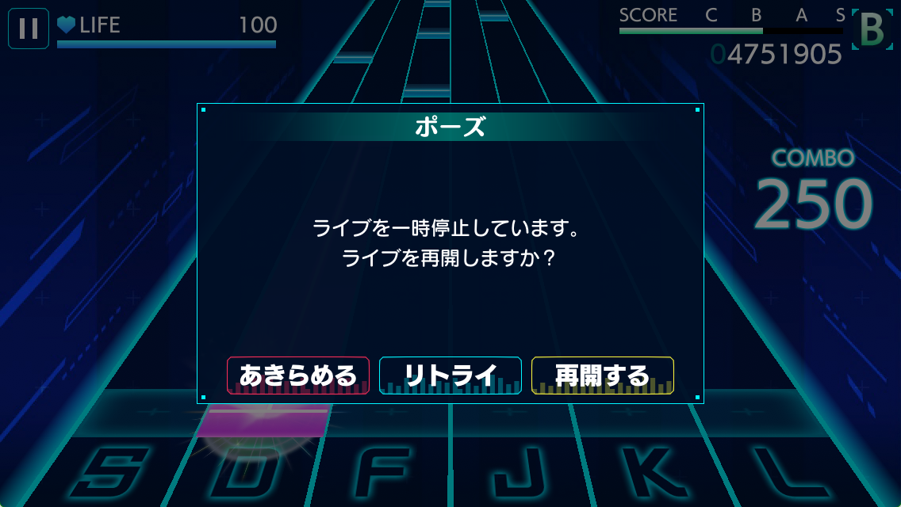
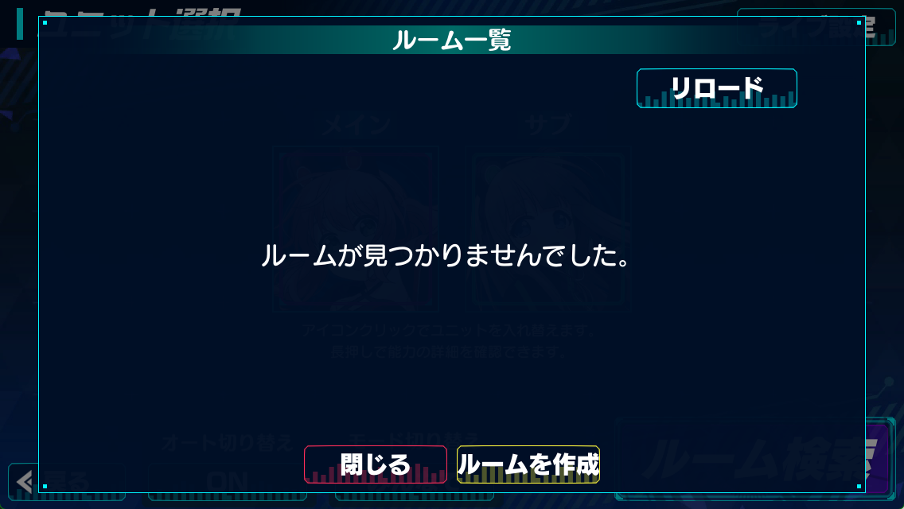
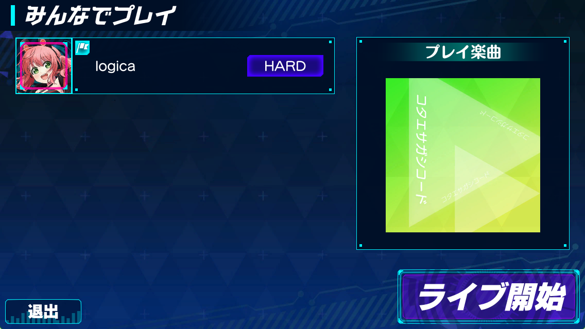
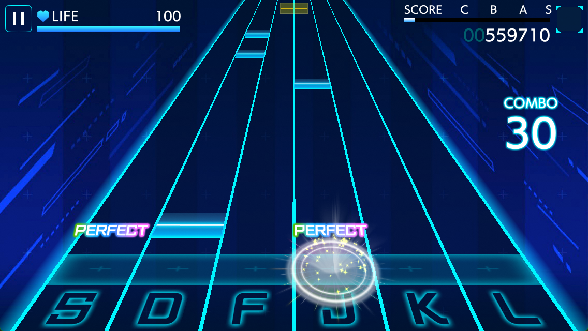
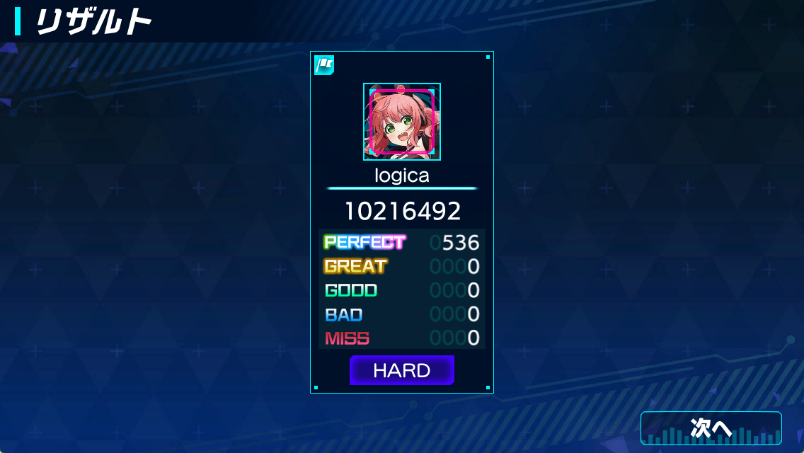
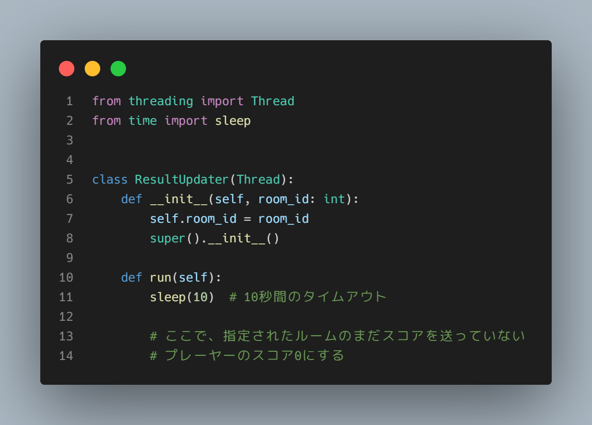
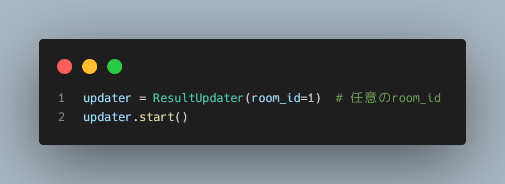
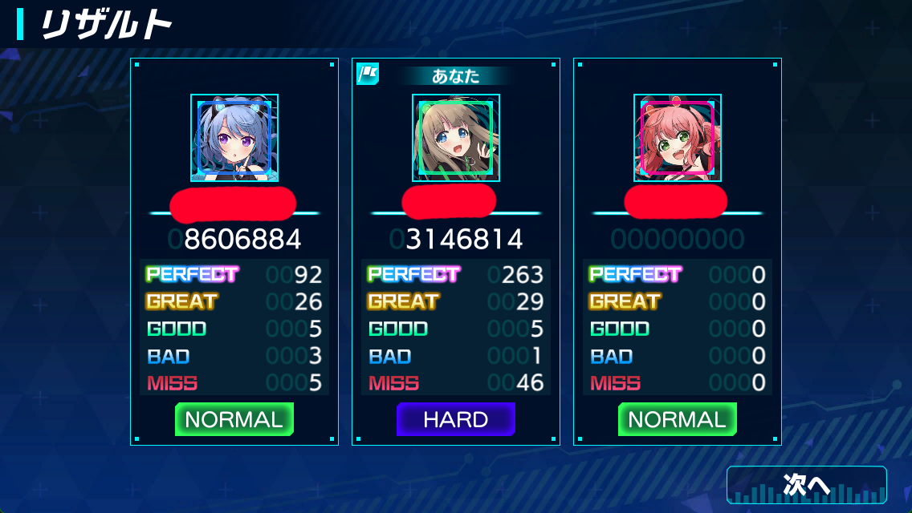

はじめまして。logica(ろじか)といいます。ヒヨッコWebエンジニアです。
普段はGoでバックエンドを書くのをメインとしていて、たまにReact + TSでフロントエンドも書いています。
気が向いたときに普段の活動をZennで発信していこうかな～と考えています。どうぞよろしく。

さて、つい1週間ほど前、縁あってKLab様主催の「KLab Server Side Camp (第二回)」に参加させていただきました。この記事はその報告ブログです。

# KLab Server Side Camp (第二回) とは

5日間、Pythonでオンライン対戦型音楽ゲームのサーバーサイドを実装する、インターン形式のイベントです。第一回と内容はほとんど同じですので、詳しい内容に興味があれば下の記事を読んでみて下さい。
[KLab公式ブログによる第一回のイベント詳細](http://dsas.blog.klab.org/archives/2022-01/52381462.html)

ゲームのサーバーを書くのは初めてだったり、普段使わないPythonでの実装だったりと不安なところは多々ありましたが、結局のところ最速で実習を終えてしまい、周りにプレッシャーを与えて勝手に申し訳なくなっていました。
~~結局REST API & SQL慣れみたいなところはあった~~

本筋の課題であるサーバーの実装はとても楽しく、それについて語ろうかとも思ったのですが、4日目に予想外のバグから「裏課題」のようなものが発生し、仲間と一緒にヒント無しでそれの解決を考える過程が個人的に一番楽しかったので、今回はこれについて語ろうと思います。
本筋の部分に関しては恐らく他の参加者たちがいっぱい書いてくれていることだと思うので、是非「KLab Server Side Camp」で検索して彼らのブログも覗いてみて下さい。

# 予想外のバグ

幸い3日目まででAPIサーバーの実装が終わっていたので、4日目は丸一日テストプレイとバグ取りをしていました。
4人くらいでワイワイ遊んで意見を交換していると、一人が「**通信対戦中に途中抜けできるのヤバくない？**」と言い出し、僕たちはその検証に乗り出しました。

## どんなバグだったのか

本来「マルチプレイ中は一時停止が無効」と仕様書に書かれていたのに、クライアントサイドの実装ではマルチプレイ中に一時停止・更にはルームの退出までできてしまったバグでした。

次の画像はマルチプレイ中なのですが、ライブ中一時停止ができてしまっています。`あきらめる`を選択すると途中抜けすることもできてしまいます。

## ゲームの仕様

このバグの重大性を理解するために、まずはこのゲームにおけるマルチプレイの流れを見ていきましょう。

まずはホストとなる人が曲を選択してルームを作成します。

プレイする人数が集まったら、ホストが全員のプレイを開始します。

**全員分のリザルトがサーバーに送られたのを確かめた後**、リザルト画面が表示されます(それぞれのクライアントに、全員分のリザルトが一緒に送られないと正しく表示ができません)。
下図では一人だけですが、最大4人まで表示されます。

## 問題点

もう皆さんお気づきでしょうか。
**全員分のリザルトが送られたのを確かめた後でないとリザルト画面を表示することができない**のに、一時停止・退出をしてしまうと**リザルトが永遠にサーバーに送られない**ことがあり得てしまう、というのがこのバグの一番マズいところです。
実際、誰か一人が途中抜けするとその人のリザルトだけが送られず無限待機が始まってしまいました。

もちろん意図された挙動ではないので、一時停止や途中抜けはサーバー側に通知されることがありません。また、ゲームのクライアントにリザルトを非同期で取ってくる機能がない以上、リザルトは全員分を一斉に送らなくてはいけません。だいぶつらい状況です。

僕たちはこの問題の調査・検証をし終えると、これをどうにかサーバー側で対処できないかとアイデアを練りました。

# 解決策

そうして出された解決策は、リザルト送信に**タイムアウト**を設けることでした。

## 必要な処理

Slackのスレッドで話し合い、この問題を解決するためには、
**最初に終わったプレーヤーがリザルトを送った一定時間後、その時点でリザルトを送っていないプレーヤーのスコアを強制的に0にする**
という処理を行う必要がある、という結論に至りました。

## 並行処理による解決

タイムアウトを設けるため、Pythonの`threading`を使用した並行処理を行うことにしました。Gopherなので、こういう問題に面した時まずgoroutineを使ったお手軽並行処理が頭にくるんですよね...
Pythonに疎いので、ベストプラクティスだったかどうかはわかりません。
[参考にした記事](https://qiita.com/simonritchie/items/1ce3914eb5444d2157ac#threading%E3%81%AE%E3%82%B3%E3%83%BC%E3%83%89%E3%82%B5%E3%83%B3%E3%83%97%E3%83%AB)

threadingでは、非常に簡単に別スレッドを建てて並行処理を実現することができます。今回は次のようなコードを書きました。

非常に簡単です。`Thread`クラスを継承し、メンバ変数を`__init__`メソッドで設定し、非同期で処理したい内容を`run`メソッドに書けば、あっという間に並行処理用のクラスの完成です。

後は任意の場所でこれをインスタンス化し、`start()`すればOKです。
`run`メソッドの中身が、非同期に実行されます。

これらを使って、実際に「10秒後にリザルトを送っていないプレーヤーのスコアを0にする」並行処理を、最初に終わったプレーヤーがリザルトを送った瞬間に開始する、という実装をしました。

実際に途中で「諦める」をしてもらった結果...

無事、途中抜けをした人のスコアを0にすることに成功しました!!

# インターンを通しての感想

全体を通して面白い課題がそろっており、特に今回語ったバグ解決は非常にエキサイティングな体験になりました。
基本的に実装する内容は普段作っているAPIサーバーと一緒だったけれども、Pythonサーバー・ゲームサーバーの実装の自信がついたのはとてもありがたかったです。今後はオンラインゲーム作成も友人と協力して手を出していこうかな、と思います。

また、最近個人開発ばかりだったので、複数人でワイワイチャットしながらデバッグするのがとても楽しかったです。複数人開発もイイネ。

KLabさん、素敵なインターンをありがとうございました。
